# 🏥 Smart Patient Tracker — Clinical ICU Monitoring & Family Care Platform

[](https://avishkarranjane.github.io/Smart-Patient-Tracker/)
[](https://avishkarranjane.github.io/Smart-Patient-Tracker/)

[](https://www.typescriptlang.org/)
[](https://react.dev/)
[](https://vitejs.dev/)
[](#-design-system--apple-health-glass)
[](#-security--privacy-architecture)
[](#)

> 🌐 **Live Deployed Application**: [https://avishkarranjane.github.io/Smart-Patient-Tracker/](https://avishkarranjane.github.io/Smart-Patient-Tracker/)
>
> **A next-generation hospital ICU monitoring, dynamic bed management, and dedicated family communication system.** Built with strict role-based access control, real-time medical telemetry, spreadsheet-style inline cell editing, and the signature **Apple Health Glass** design system.

---

## 📑 Table of Contents

- [Overview](#-overview)
- [System Architecture](#-system-architecture)
- [Quick Start & Demo Credentials](#-quick-start--demo-credentials)
- [Production File & Directory Structure](#-production-file--directory-structure)
- [Feature Deep Dive](#-feature-deep-dive)
  - [1. Authentication & Role-Based Access Control (RBAC)](#1-authentication--role-based-access-control-rbac)
  - [2. Ward & Patient Cell Editor Interface](#2-ward--patient-cell-editor-interface)
  - [3. Customizable Clinical Overview Dashboard](#3-customizable-clinical-overview-dashboard)
  - [4. Real-Time Patient Telemetry & Waveform Monitors](#4-real-time-patient-telemetry--waveform-monitors)
  - [5. Connected Medical Device Telemetry](#5-connected-medical-device-telemetry)
  - [6. 24-Hour Daily Clinical Reports Archive](#6-24-hour-daily-clinical-reports-archive)
  - [7. Bi-Directional Family Communication Desk](#7-bi-directional-family-communication-desk)
  - [8. Patient Daily Timetable & Care Routine](#8-patient-daily-timetable--care-routine)
  - [9. Rapid Response & Emergency Broadcasting](#9-rapid-response--emergency-broadcasting)
- [Design System — "Apple Health Glass"](#-design-system--apple-health-glass)
- [Clinical Telemetry Reference Specs](#-clinical-telemetry-reference-specs)
- [Setup & Local Development](#-setup--local-development)
- [Security & Privacy Architecture](#-security--privacy-architecture)

---

## 🩺 Overview

Modern hospital intensive care units (ICUs) demand instant vital visibility, zero-latency clinical triage, dynamic bed turnover management, and compassionate, real-time communication with patient families without compromising medical privacy.

**Smart Patient Tracker** bridges this gap through two synchronized interfaces:
1. **Clinical Staff Interface (Doctor & Nurse)**: Complete ward oversight, 2-second vital telemetry, interactive device controls, floor maps, bed lifecycle management, and a spreadsheet-style cell editor.
2. **Dedicated Family Care Portal**: A private, HIPAA-isolated portal displaying their loved one's resting condition in warm, clear terms, medical schedules, 24-hour doctor summaries, and direct 2-way messaging with the nursing station.

---

## 🏛️ System Architecture

```mermaid
graph TD
    subgraph Client Layer ["Client Web Interface (React 19 + TypeScript)"]
        LoginPage["/login (Tabbed Portal Gateway)"]
        DashboardShell["Dashboard Shell (Sidebar + Topbar)"]
        FamilyPortal["/family (Dedicated Family Member Portal)"]
        WardEditor["/ward-editor (Ward & Cell Editor)"]
    end

    subgraph State & Data Engine ["State & Telemetry Engine"]
        AuthCtx["AuthContext (RBAC & Session Persistence)"]
        WardCtx["WardManagementContext (Wards, Beds, Cell Stores)"]
        MsgCtx["MessageContext (Bi-Directional Messaging)"]
        AlertCtx["AlertContext (Vital Thresholds & Canary)"]
        SocketHook["useWardSocket (2-Second Heartbeat Engine)"]
    end

    subgraph Views & Modals ["Clinical Views & Modals"]
        GridMode["Telemetry Grid View"]
        MatrixMode["Bed Matrix / Floor Map"]
        TableMode["High-Density Clinical Table"]
        DeviceModal["Device Telemetry & Controls"]
        EditModal["Deep Cell Edit Modal"]
        TransferModal["Bed Transfer Modal"]
        AdmitModal["Patient Admission Modal"]
    end

    LoginPage -->|Doctor / Staff| DashboardShell
    LoginPage -->|Family Member| FamilyPortal
    DashboardShell --> GridMode
    DashboardShell --> MatrixMode
    DashboardShell --> TableMode
    DashboardShell --> WardEditor

    AuthCtx --> DashboardShell
    WardCtx --> MatrixMode
    WardCtx --> WardEditor
    SocketHook --> GridMode
    SocketHook --> TableMode
    SocketHook --> FamilyPortal
```



---

## 🔑 Quick Start & Demo Credentials

The platform includes a dedicated multi-portal authentication interface with **instant 1-click demo logins** (no manual typing required) and authentic credential verification:

| Portal Tab | Username / ID | Password / PIN | Permissions & Role Scope | Default Route |
| :--- | :--- | :--- | :--- | :--- |
| **Doctor Portal** | `doctor` | **`doctor123`** | Full ward oversight, cell editing, threshold calibration, medical sign-offs | `/` |
| **Staff & Nurse Portal** | `staff` | **`staff123`** | Continuous bed monitoring, alert acknowledgments, bed turnover, family messaging | `/` |
| **Family Portal** | Select **Person 1 – 6** | **`family123`** | **Strict 1-Patient Isolation**: Real-time resting condition, timetable, reports, messaging | `/family` |

> ⚡ **Tip**: On the **[Login Screen](http://localhost:5173/login)**, click **"⚡ Instant Demo Login"** or select any patient pill to authenticate immediately.

---

## 📁 Production File & Directory Structure

```
dashboard/
├── index.html                           # Single-page application entry point
├── package.json                         # Dependencies & npm scripts
├── tsconfig.json                        # Root TypeScript project references
├── tsconfig.app.json                    # Application compiler configuration
├── vite.config.ts                       # Vite bundler & HMR configuration
│
└── src/
    ├── main.tsx                         # React 19 DOM root mount
    │
    ├── app/                             # Core application shell & providers
    │   ├── App.tsx                      # Main router & shell coordinator
    │   ├── AuroraBackground.tsx         # Subtle ambient canvas gradient blobs
    │   ├── providers.tsx                # Unified context provider hierarchy
    │   └── app.module.css               # Shell layout & sidebar/topbar grid
    │
    ├── pages/                           # Application screens (1:1 feature mapping)
    │   ├── Login/                       # Authentication gateway
    │   │   ├── LoginPage.tsx            # 3-portal tabbed login interface
    │   │   └── login.module.css         # Apple Health Glass login styling
    │   │
    │   ├── Overview/                    # Main clinical triage dashboard
    │   │   ├── OverviewPage.tsx         # View mode coordinator & search
    │   │   ├── DashboardToolbar.tsx     # View switcher, risk filters, sorting
    │   │   ├── PatientCard.tsx          # Card view with live vitals & status rings
    │   │   ├── BedMatrixView.tsx        # Physical floor map & bed turnover matrix
    │   │   ├── ClinicalTableView.tsx    # High-density triage table with sortable headers
    │   │   ├── KpiRow.tsx               # Collapsible ward-level statistics bar
    │   │   └── overview.module.css      # Overview layout & component styles
    │   │
    │   ├── WardEditor/                  # Administrative Ward & Cell Editor
    │   │   ├── WardEditorPage.tsx       # Main editor layout & KPI summary
    │   │   ├── WardConfigCard.tsx       # Collapsible ward parameters editor
    │   │   ├── WardCellTable.tsx        # Spreadsheet table with inline cell editing
    │   │   ├── EditCellModal.tsx        # Deep patient record editor modal
    │   │   ├── TransferPatientModal.tsx # Cross-bed & cross-ward transfer modal
    │   │   ├── AdmitPatientModal.tsx    # Patient admission & bed assignment modal
    │   │   └── wardEditor.module.css    # Editor table & action styling
    │   │
    │   ├── PatientDetail/               # Deep clinical monitor per patient
    │   │   ├── PatientDetailPage.tsx    # Main patient monitor page
    │   │   ├── VitalTiles.tsx           # Large typography vital metric tiles
    │   │   ├── VitalTrendChart.tsx      # Multi-hour trend chart with canvas smoothing
    │   │   ├── ConnectedDevicesPanel.tsx# Connected medical devices list
    │   │   └── detail.module.css        # Patient monitor layout
    │   │
    │   ├── Family/                      # Dedicated Loved One's Portal
    │   │   ├── FamilyPortalPage.tsx     # Calm, transparent patient status & reports
    │   │   └── family.module.css        # Soft pastel card layout
    │   │
    │   ├── Alerts/                      # Ward-wide alert management
    │   │   ├── AlertsPage.tsx           # Real-time alert feed & batch acknowledgement
    │   │   ├── AlertRow.tsx             # Individual alert row item
    │   │   └── alerts.module.css        # Alert notification styling
    │   │
    │   ├── Devices/                     # Central medical equipment gateway
    │   │   ├── DevicesPage.tsx          # All ward devices overview
    │   │   ├── DeviceGatewayCard.tsx    # Individual device status card
    │   │   └── devices.module.css       # Device list styling
    │   │
    │   ├── Trends/                      # Ward clinical analytics
    │   │   ├── TrendsPage.tsx           # Multi-patient comparative graphs
    │   │   ├── WardAverageChart.tsx     # Ward-wide baseline vital trends
    │   │   └── trends.module.css        # Analytics styling
    │   │
    │   └── Settings/                    # Thresholds & notification settings
    │       ├── SettingsPage.tsx         # Clinical threshold calibration
    │       ├── ThresholdSliders.tsx     # Interactive slider controls
    │       └── settings.module.css      # Settings styling
    │
    ├── components/                      # Shared reusable UI & layout components
    │   ├── auth/
    │   │   └── ProtectedRoute.tsx       # RBAC route guard & family isolation
    │   ├── layout/
    │   │   ├── Sidebar.tsx              # Primary navigation with live alert badges
    │   │   ├── Sidebar.module.css       # Sidebar styling
    │   │   ├── Topbar.tsx               # Ward selector, search, live clock & user badge
    │   │   ├── Topbar.module.css        # Topbar styling
    │   │   └── PageTransition.tsx       # Smooth page mount animation wrapper
    │   ├── patient/
    │   │   ├── DailyReportsArchive.tsx  # 24-hour clinical reports accordion
    │   │   ├── FamilyMessageDesk.tsx    # Bi-directional messaging feed
    │   │   ├── PatientTimetable.tsx     # Medication & visiting routine schedule
    │   │   └── RapidResponseModal.tsx   # Code Blue emergency broadcaster modal
    │   ├── devices/
    │   │   └── DeviceTelemetryModal.tsx # Interactive device modal & oxygen controls
    │   └── ui/
    │       ├── GlassCard.tsx            # Apple Health glass card primitive
    │       ├── StatusRing.tsx           # SVG circular status ring indicator
    │       ├── VitalChip.tsx            # Micro-vital indicator chip
    │       ├── Switch.tsx               # Apple-style toggles
    │       └── Toast.tsx                # Floating status notifications
    │
    ├── context/                         # React state management
    │   ├── AuthContext.tsx              # Authentication, roles, and permissions
    │   ├── WardManagementContext.tsx    # Wards, beds, and cell data persistence
    │   ├── MessageContext.tsx           # Patient & family chat system
    │   ├── AlertContext.tsx             # Alert queues and canary monitor
    │   └── ThemeContext.tsx             # Design system theme provider
    │
    ├── services/                        # Modular API & storage service abstractions
    │   ├── api/
    │   │   ├── patients.ts              # Patient record and acuity utilities
    │   │   ├── ward.ts                  # Bed capacity and occupancy calculations
    │   │   └── devices.ts               # Equipment telemetry utilities
    │   └── index.ts                     # Service exports barrel
    │
    ├── hooks/                           # Custom React telemetry hooks
    │   ├── useWardSocket.ts             # 2-second vital simulation engine
    │   ├── useLiveVitals.ts             # Single patient vital stream
    │   ├── useAlerts.ts                 # Threshold scanning & auto-alert generator
    │   ├── useThresholds.ts             # Threshold state manager
    │   └── useSystemHealth.ts           # Intranet connection health heartbeat
    │
    ├── types/                           # Strict TypeScript interfaces
    │   ├── auth.ts                      # UserRole, Permission, and User definitions
    │   ├── ward.ts                      # Ward, Bed, BedStatus, and EditablePatientRecord
    │   ├── patient.ts                   # Patient, Vitals, Schedule, DailyReport
    │   ├── device.ts                    # Device, DeviceTelemetry, TrustStatus
    │   ├── alert.ts                     # Alert, AlertSeverity definitions
    │   └── threshold.ts                 # Clinical vital thresholds
    │
    ├── utils/                           # Pure helper functions
    │   ├── constants.ts                 # Patient names, initial records, and LOINC codes
    │   ├── formatters.ts                # Time, uptime, and number formatters
    │   └── vitalStatus.ts               # Acuity scoring logic
    │
    └── styles/                          # Global styling & design tokens
        ├── tokens.css                   # Apple Health Glass variables
        ├── globals.css                  # Global resets & font setup
        └── animations.css               # Smooth CSS keyframes
```

---

## 🌟 Feature Deep Dive

### 1. Authentication & Role-Based Access Control (RBAC)
- **Multi-Role Portals**: Dedicated tabs for **Doctor**, **Staff Nurse**, and **Family Member**.
- **Role Isolation**: Family members are strictly isolated to `/family` and cannot view other patients, settings, alerts, or clinical configuration.
- **Route Guarding**: `ProtectedRoute` verifies active credentials, role membership, and explicit permissions (`EDIT_PATIENT_CELLS`, `CONTROL_DEVICES`).

### 2. Ward & Patient Cell Editor Interface
- **Spreadsheet-Style Inline Editing**: Click on any table cell (Bed #, Patient Name, Diagnosis, Clinical Condition, Admit Date, Surgery/Procedure, Expected Exit Date, Attending Doctor, Attending Nurse, Dietary Regimen) to edit directly on screen. Press <kbd>Enter</kbd> or click `✓` to save instantly with live `localStorage` persistence.
- **Deep Cell Edit Modal**: Modify medications list, care plan summary, and surgical details in a clean modal window.
- **Bed Lifecycle Management**:
  - `Occupied`: Patient assigned with live telemetry.
  - `Available`: Disinfected and ready for immediate admission.
  - `Cleaning`: Automatically triggered upon patient transfer or discharge (queuing terminal UV sanitization).
  - `Maintenance`: Bed flagged for sensor calibration or equipment servicing.
- **Patient Transfers**: Transfer patients between beds or wards with an optional clinical transfer reason; frees the previous bed to `'cleaning'` state.
- **Patient Admission**: Direct assignment of new patients to available beds with custom diagnoses and care regimens.
- **One-Click JSON Export**: Instant backup of all ward and patient data.

### 3. Customizable Clinical Overview Dashboard
- **View Modes**:
  1. **🔲 Telemetry Grid**: Visual card grid displaying real-time vitals, status rings, and machine learning risk badges.
  2. **🛏️ Bed Matrix / Floor Map**: Physical ward floor plan with colored bed lifecycle cards and fast bed-turnover actions.
  3. **📋 Clinical Triage Table**: High-density table designed for rapid clinical scanning during rounds with sortable column headers.
- **Dynamic Ward Switcher**: Switch between *ICU Ward 4 (Cardiovascular)*, *ICU Ward 2 (Trauma & Neuro)*, and *HDU Stepdown Recovery Wing*.
- **Acuity Filters**: Quick filters for *Critical Alert Only*, *Watch / Elevated*, and *Stable Patients*.
- **Multi-Metric Sorting**: Sort by *Bed Order*, *Risk Severity*, *Lowest SpO2*, or *Highest Heart Rate*.
- **Collapsible KPI Summary**: Toggle the top vital KPI summary bar with saved preferences.

### 4. Real-Time Patient Telemetry & Waveform Monitors
- **2-Second Simulation Engine**: Simulates physiological fluctuations in heart rate, SpO2, systolic/diastolic blood pressure, respiratory rate, and body temperature.
- **Acuity Scoring**: Automatically classifies patient condition into Stable (🟢), Watch (🟡), or Critical (🔴).
- **Interactive Waveforms**: Smooth historical canvas graphs with timestamp tracking.

### 5. Connected Medical Device Telemetry
- **Interactive Device Drawer**: Click on any bedside device (e.g. *Dräger Evita V800 Ventilator*, *Baxter Spectrum Infusion Pump*, *Philips IntelliVue Monitor*) to view real-time machine telemetry.
- **Live Device Parameters**: Oxygen flow (L/min), airway pressure, tidal volume, FiO2 %, perfusion index, and battery status.
- **Control Actions**: Mute clinical alarms and trigger emergency battery checks.

### 6. 24-Hour Daily Clinical Reports Archive
- **Automated 24-Hour Summaries**: Structured reports detailing daily 24-hour vital averages (HR, SpO2, BP, Temp).
- **Fluid Balance Tracking**: Total 24-hour intake (mL) versus output (mL) to detect fluid overload or dehydration.
- **Doctor Sign-Off**: Verification stamps from attending physicians.

### 7. Bi-Directional Family Communication Desk
- **Connected Nursing Station Chat**: Send messages between family members and clinical staff with instant real-time synchronization.
- **Quick Reply Chips**: Pre-configured nursing status updates (*"Patient is resting comfortably"*, *"Vitals are stable"*, *"Doctor rounds scheduled"*).

### 8. Patient Daily Timetable & Care Routine
- **Structured Schedule**: Time-stamped daily routines categorized by *Medicine*, *Visiting*, *Sleep*, *Meals*, *Doctor Rounds*, and *Vitals Check*.
- **Progress Tracking**: Live status badges for *Completed*, *In Progress*, and *Upcoming* tasks.

### 9. Rapid Response & Emergency Broadcasting
- **One-Touch Code Blue Trigger**: Triggers an immediate ward-wide emergency alert banner with audio-visual notifications for the resuscitation team.

---

## 🎨 Design System — "Apple Health Glass"

The application implements a custom **Apple Health Glass** aesthetic, utilizing translucent frosted surfaces, subtle background blur, refined typography, and purposeful medical color semantics.

### Color Tokens

```css
:root {
  /* Canvas & Glass */
  --canvas:        #EEF2F7;
  --glass:         rgba(255, 255, 255, 0.72);
  --glass-strong:  rgba(255, 255, 255, 0.88);
  --glass-border:  rgba(255, 255, 255, 0.90);

  /* Ink Typography */
  --ink:           #1C2331;   /* Primary clinical ink */
  --ink-soft:      #5B6472;   /* Secondary descriptive ink */
  --ink-faint:     #8A93A3;   /* Metadata & timestamps */

  /* Brand Accents */
  --blue:          #2A85FF;   /* Primary clinical blue */
  --blue-soft:     rgba(42, 133, 255, 0.12);
  --lavender:      #8C7CF0;   /* Secondary analytics accent */

  /* Medical Status Semantics (Strictly reserved for clinical status) */
  --mint:          #2FBD85;   /* Stable / Normal */
  --amber:         #F5A93F;   /* Watch / Warning */
  --coral:         #FF5C6C;   /* Critical / Alarm */
}
```

---

## 📊 Clinical Telemetry Reference Specs

| Vital Parameter | Standard Range | Watch / Elevated | Critical Alarm | LOINC Code |
| :--- | :--- | :--- | :--- | :--- |
| **Heart Rate (HR)** | 60 – 95 bpm | 96 – 115 bpm | < 50 or > 115 bpm | `8867-4` |
| **Oxygen Saturation (SpO₂)** | 96% – 100% | 93% – 95% | < 93% | `2708-6` |
| **Systolic Blood Pressure (SBP)** | 100 – 135 mmHg | 136 – 150 mmHg | < 90 or > 155 mmHg | `8480-6` |
| **Diastolic Blood Pressure (DBP)** | 60 – 85 mmHg | 86 – 95 mmHg | < 55 or > 95 mmHg | `8462-4` |
| **Respiratory Rate (RR)** | 12 – 18 /min | 19 – 24 /min | < 10 or > 24 /min | `9279-1` |
| **Core Temperature** | 36.5°C – 37.3°C | 37.4°C – 38.0°C | > 38.2°C | `8310-5` |

---

## 💻 Setup & Local Development

### Prerequisites
- **Node.js**: v18.0.0 or later
- **npm**: v9.0.0 or later

### Installation

```bash
# 1. Clone the repository
git clone https://github.com/your-username/smart-patient-tracker.git

# 2. Navigate to the dashboard directory
cd "Smart Patient Tracker/dashboard"

# 3. Install dependencies
npm install

# 4. Start local development server
npm run dev
```

The application will be available at **`http://localhost:5173/`**.

### Production Build & Validation

```bash
# Type check without emitting files
npx tsc --noEmit

# Compile production bundle
npm run build

# Preview production build locally
npm run preview
```

---

## 🔒 Security & Privacy Architecture

- **Single-Patient Family Isolation**: Family access is strictly restricted to their designated patient record. Navigating to any clinical staff routes (`/`, `/ward-editor`, `/settings`, `/alerts`) automatically redirects the family member back to `/family`.
- **Encrypted Local Storage**: Session tokens and customized clinical records are encrypted and isolated per session.
- **Audit-Logged Actions**: Patient transfers, discharges, and cell edits log audit timestamps for clinical accountability.

---

## 📄 License

This software is developed for clinical demonstration, ICU telemetry monitoring, and medical pair programming. Distributed under the **MIT License**.
